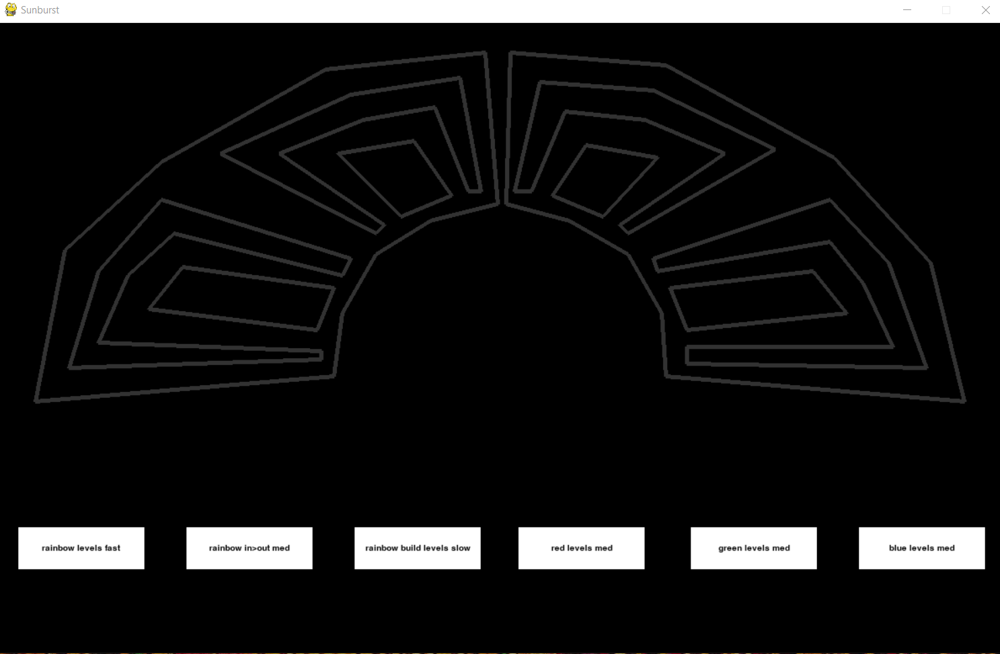

# Sunburst

Sunburst is a Python program used for building and testing ideas for a lightshow.

## Background


Sunburst is part of a larger project to modify the above installation by artist Erika Margaret to include 10 sections of programmable RGB LED lights. It functions to address two needs:

1. I wanted to test ways of building different effects without using the actual structure and its hardware. 
- The screen display shows 10 shapes that are in the same configuration as the planned lighting for this installation, mapped using coordinates read from a csv file and rendered using the PyGame library.
- Color objects represent the different states of the lights--on/of--as well as the actual light colors.
- This structure is used to build functions that represent scripts for different lighting effects.
- The output of these scripts can be viewed on the PyGame window.

2. As this project is a collaborative effort between myself and the artist, and has also recieved input from other artists in our collective, I wanted a simple way to communicate my ideas to collaborators. 
- By assigning lighting effect functions to buttons, each effect can be shown by clicking the associated button.

## Required Features
This project has also served to learn Python and practice Object Oriented Programming. It meets the requirements for the final project in my Code Louisville Python class.

1. Create a class, then create at least one object of that class and populate it with data. The value of at least one object must be used somewhere in your code.
2. Create a dictionary or list, populate it with several values, retrieve at least one value, and use it in your program.
3. Read data from an external file, such as text, JSON, CSV, etc and use that data in your application.
4. Visualize data in a graph, chart, or other visual representation of data.

## Usage

Download and install [Python 3](https://www.python.org/downloads/)

Clone project files from repository.
```
git clone https://github.com/discolarrence/sunburst.git
```
Install/update necessary libraries.
```
pip install 'pygame==2.0.1'
pip install 'pandas==1.3.0'
```
Run application.
```
python main.py
```
The PyGame window will open.

Use mouse to click buttons to see each light show effect. To quit, close PyGame window or ESC.

## Contributing
Pull requests are welcome.

## Support
Contact <discolarrence@gmail.com>

## License
[MIT](https://choosealicense.com/licenses/mit/)